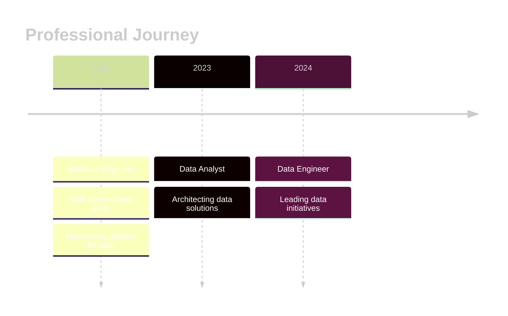

<!-- 
  ╔══════════════════════════════════════════════════════════════════════════════╗
  ║                    DATA ENGINEER PORTFOLIO - GITHUB PROFILE                    ║
  ║                         Created with ❤️ and lots of ☕                         ║
  ╚══════════════════════════════════════════════════════════════════════════════╝
-->

<!-- Animated Header Banner -->

  

<!-- Animated Typing Effect -->

  

<!-- Glow Divider -->

  

<!-- Profile Stats Row -->

  
  <!-- Profile Views -->
  
  &nbsp;
  <!-- Followers -->
  
  &nbsp;
  <!-- Stars -->
  

 

<!-- Animated Snake Contribution Graph -->

  <picture>
    <source media="(prefers-color-scheme: dark)" srcset="https://raw.githubusercontent.com/platane/snk/output/github-contribution-grid-snake-dark.svg" />
    <source media="(prefers-color-scheme: light)" srcset="https://raw.githubusercontent.com/platane/snk/output/github-contribution-grid-snake.svg" />
    
  </picture>

 

<!-- Glow Divider -->

  

 

<!-- About Me Section -->

  <h2>
    
    &nbsp;About Me&nbsp;
    
  </h2>

  
  <!-- Animated Quote -->
  

 

<!-- Professional Journey Timeline -->

 

<!-- Skills Matrix -->

  <h2>
    
    &nbsp;Tech Arsenal&nbsp;
    
  </h2>

<!-- Animated Skill Icons Grid -->

  <!-- Programming Languages -->
  <h3>💻 Languages</h3>
  

    
  

  <!-- Data Engineering -->
  <h3>🗄️ Data Engineering</h3>
  

    
  

  <!-- Cloud & DevOps -->
  <h3>☁️ Cloud & DevOps</h3>
  

    
  

  <!-- Tools -->
  <h3>🛠️ Tools</h3>
  

    
  

 

<!-- Glow Divider -->

  

 

<!-- GitHub Stats Dashboard -->

  <h2>
    
    &nbsp;GitHub Analytics&nbsp;
    
  </h2>

<!-- Trophies -->

  

 

<!-- Stats Cards Grid -->

  <table width="100%">
    <tr>
      <td width="50%" valign="top">
        
      </td>
      <td width="50%" valign="top">
        
      </td>
    </tr>
  </table>

 

<!-- Top Languages -->

  

 

<!-- Activity Graph -->

  

 

<!-- Glow Divider -->

  

 

<!-- Featured Projects -->

  <h2>
    
    &nbsp;Featured Projects&nbsp;
    
  </h2>

  <table width="100%">
    <tr>
      <td width="50%">
        
      </td>
      <td width="50%">
        
      </td>
    </tr>
    <tr>
      <td width="50%">
        
      </td>
      <td width="50%">
        
      </td>
    </tr>
  </table>

 

<!-- Glow Divider -->

  

 

<!-- Connect Section -->

  <h2>
    
    &nbsp;Let's Connect&nbsp;
    
  </h2>
  
  

    <em>Open for collaborations, and data engineering discussions! 🚀</em>
  

 

<!-- Social Badges with Glow -->

  
  <!-- LinkedIn -->
  
  &nbsp;
  <!-- Email -->
  
  &nbsp;
  <!-- Portfolio -->
  

 

<!-- Status Badges -->

  
  
  &nbsp;
  
  &nbsp;
  

 

<!-- Animated Footer -->

  

<!-- Hidden Footer Note -->
<!--
  🎨 Designed with passion for data and code
  🌟 Star this repo if you like my profile!
  📧 Feel free to reach out for collaborations
-->
